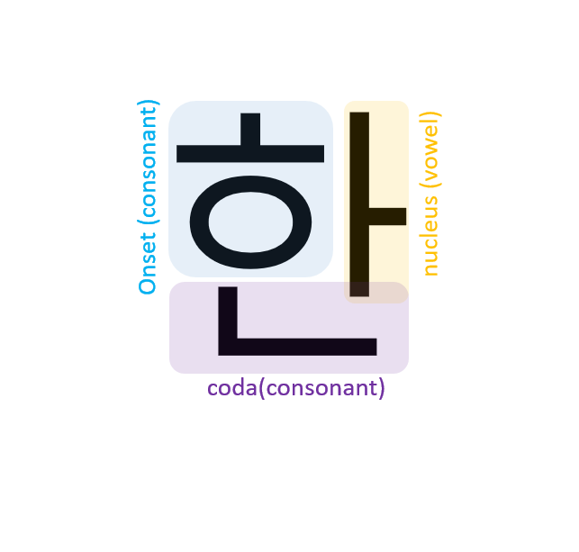

# Korean Character Romanization
Romanized the Korean to English

This is not perfect for Korean pronunciation because the phonological process is not reflected.


## Characteristic of Korean Character



### Onset

| KOREAN(onset) | ROMAN |
| ------------- | ----- |
| ㄱ            | g     |
| ㄲ            | kk    |
| ㄴ            | n     |
| ㄷ            | d     |
| ㄸ            | tt    |
| ㄹ            | r     |
| ㅁ            | m     |
| ㅂ            | b     |
| ㅃ            | pp    |
| ㅅ            | s     |
| ㅆ            | ss    |
| ㅇ            |       |
| ㅈ            | j     |
| ㅉ            | jj    |
| ㅊ            | ch    |
| ㅋ            | k     |
| ㅌ            | t     |
| ㅍ            | p     |
| ㅎ            | h     |

### Nucleus

| KOREAN(Nucleus) | ROMAN |
| --------------- | ----- |
| ㅏ              | a     |
| ㅐ              |       |
| ㅑ              |       |
| ㅒ              |       |
| ㅓ              |       |
| ㅔ              |       |
| ㅕ              |       |
| ㅖ              |       |
| ㅗ              |       |
| ㅘ              |       |
| ㅙ              |       |
| ㅚ              |       |
| ㅛ              |       |
| ㅜ              |       |
| ㅝ              |       |
| ㅞ              |       |
| ㅟ              |       |
| ㅠ              |       |
| ㅡ              |       |
| ㅢ              |       |
| ㅣ              |       |

### Coda

| KOREAN(Coda) | ROMAN |
| ------------ | ----- |
|              |       |
| ㄱ           | k     |
| ㄲ           | k     |
| ㄳ           | k     |
| ㄴ           | n     |
| ㄵ           | n     |
| ㄶ           | n     |
| ㄷ           | t     |
| ㅌ           | l     |
| ㄺ           | k     |
| ㄻ           | m     |
| ㄼ           | p     |
| ㄽ           | t     |
| ㄾ           | t     |
| ㄿ           | p     |
| ㅀ           | l     |
| ㅁ           | m     |
| ㅂ           | p     |
| ㅄ           | p     |
| ㅅ           | t     |
| ㅆ           | t     |
| ㅇ           | ng    |
| ㅈ           | t     |
| ㅊ           | t     |
| ㅋ           | k     |
| ㅌ           | t     |
| ㅍ           | p     |
| ㅎ           |       |


## Usage

```python
# Import data set --------------------------------------------------
korean_words = pd.DataFrame({"KOREAN": ["안녕하세요",
                                        "감사합니다",
                                        "반갑습니다"],
                             "MEANING": ["Hi",
                                         "Thank you",
                                         "Nice to meet you"]})

# Romanized --------------------------------------------------------
nCores = cpu_count()
romanized_string = dd.from_pandas(korean_words, npartitions=nCores).\
   map_partitions(
      lambda df : df.apply(
         lambda x : split_kor(x.KOREAN), axis=1)).\
   compute(scheduler='processes')

korean_words["ROMANIZED"] = romanized_string
```

